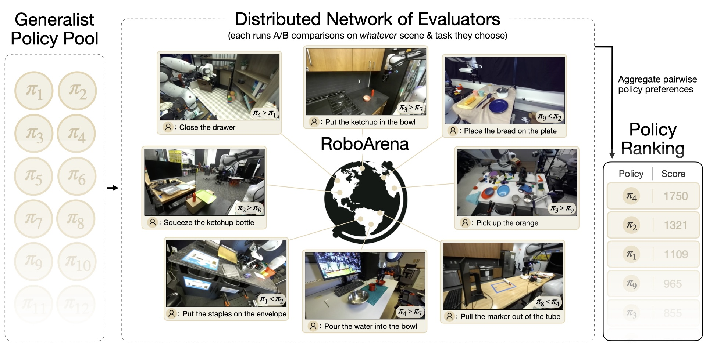

# RoboArena



RoboArena is a distributed, scalable benchmark for generalist robot policies. For more details about RoboArena, please check our [website](https://robo-arena.github.io/).

This repo contains example code and instructions for:
(1) training VLA policies on the DROID dataset
(2) serving your policy via a remote policy server, to make it ready for RoboArena evaluation
(3) evaluating your policies in simulated environments before submitting them for RoboArena eval


## Getting Started

First, install the required packages for serving a (dummy) policy:
```bash
uv sync
uv pip install -e .
```

To start a policy server for a dummy policy, run:
```bash
uv run roboarena/policy_server.py
```

To query the policy server, in a separate shell, run:
```bash
uv run roboarena/policy_client.py
```


## Serving Your Policy for RoboArena Evaluation

If you have trained a policy and want to serve it as a remote policy server for RoboArena evaluation, make sure
it matches the interface of the `BasePolicy` class in [`policy.py`](roboarena/policy.py).

Then, create a policy server:
```python
from roboarena import policy_server
policy = YourPolicy()
config = policy_server.PolicyServerConfig(
    image_resolution=(224, 224),
    needs_wrist_camera=True,
    n_external_cameras=1,
    needs_stereo_camera=False,
    action_space="joint_position",
)
server = policy_server.WebsocketPolicyServer(policy, config)
```

The `PolicyServerConfig` is used to tell the client script, what observations the policy expects and what actions it returns. 
This way, we only send the required information back and forth, minimizing communication latency. 
Check [`roboarena/policy_server.py`](roboarena/policy_server.py) for all available options.

Once you served your policy, to test it you can run the following in a separate shell:
```bash
uv run scripts/test_policy_server.py
```


## Testing Your Policy in Simulation

Before submitting your policy for RoboArena evaluations, we recommend you test it in simulation, to make sure that the behavior is reasonable.

To evaluate your policy in simulation, follow the instructions for serving it on a remote server above. 
Then, check out the [DROID simulated evaluation repo](https://github.com/arhanjain/sim-evals) and follow the instructions there.


## Training VLAs on DROID

RoboArena leverages the DROID platform. For a full example of training a SoTA VLA on the DROID dataset (that is ready for RoboArena eval), 
please check the DROID training examples in the [`openpi`](https://github.com/Physical-Intelligence/openpi) repo!
